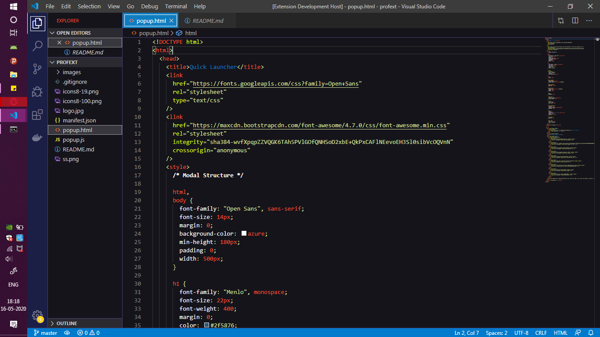
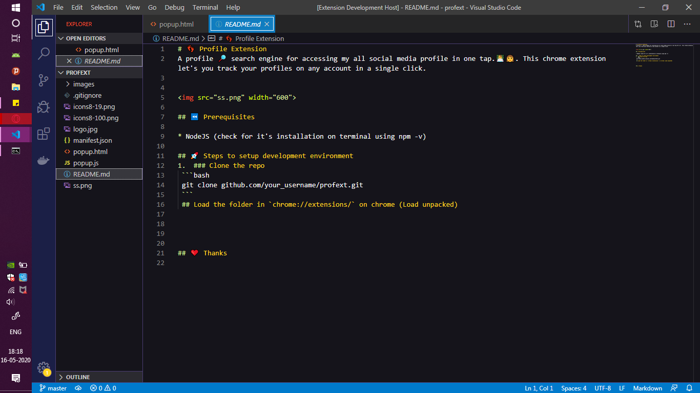

## Simpsons themed VSCode Color Theme
Look Marge! We made it to VS Code.. Yayyy...

### Preview

### Installation
* Install Visual Studio Code
* Launch Visual Studio Code
* Go to the Extensions View using CTRL+Shift+X
* Search for simpsons
* Click on Install to install the Color Theme
* Click on Reload to reload VSCode
* From the menu bar click: Code > Preferences > Color Theme > Pick Simpsons Palette

### Colors for this Theme were chosen from the following Sources:
[Marge Color Pallete](https://www.schemecolor.com/marge-the-simpsons-cartoon-colors.php)

### Collaborators
[Garima Singh](https://github.com/garimasingh128)

**Enjoy!**

